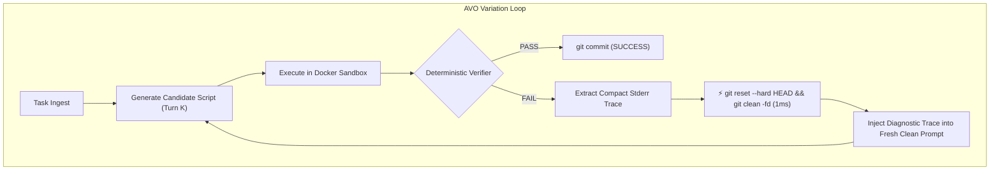

# Can NVIDIA’s AVO Make a 7B Local Model a Better Coding Agent?

*By Chris Borkert · Draft · August 2026*

A few weeks ago, NVIDIA published **[Agentic Variation Operators (AVO)](https://arxiv.org/abs/2603.24517)**. 

The paper claimed dramatic jumps on frontier models: wrapping Claude Opus in an evolutionary loop with instant rollbacks and meta-supervisors pushed ARC-AGI from a 30% baseline to 100%, and generated attention kernels on DGX B200s faster than FlashAttention-4.

I wanted to see what happens when you strip away the multi-GPU clusters and apply those exact harness concepts locally to small models (`phi4:14b`, `qwen2.5-coder:7b`) running on Apple Silicon unified memory under a tight RAM budget.

The results were revealing. The harness didn't magically turn a 7B model into Claude Opus, but it did uncover a fundamental flaw in how people build multi-turn agents for local models—and how to fix it.

---

## Part 1: The Local Prototype on Algorithmic Optimization

When you give a 12B or 14B model a coding problem in a standard multi-turn chat setup, it tends to break down in predictable ways:
* **Tokenization and boundary errors:** It writes plausible-looking logic that fails on edge cases.
* **Context rot:** When it fails on Turn 1, the error traceback enters the prompt history. By Turn 3, it is overwhelmed by its own previous mistakes and enters a repetitive apology loop.
* **Strategy collapse:** Under correction, local models get cautious and retreat to naive, broken implementations just to avoid syntax errors.

To test whether AVO's core loop could prevent this, I built a local prototype with four moving pieces:
1. **1ms Git Sandbox:** Every candidate patch runs in an ephemeral workspace. If tests fail, `git reset --hard HEAD && git clean -fd` wipes the disk in about a millisecond.
2. **Deterministic Verifier:** An objective binary test (`pytest` or shell assertions with exit code `0` vs `!= 0`).
3. **Context Isolation:** The model never sees a transcript of its failed previous turns. It receives only the latest error traceback injected into a clean prompt.
4. **Meta-Supervisor:** If the model fails three consecutive times on the same approach (e.g. tweaking a broken regex), the supervisor forces a strategy pivot.

In an algorithmic optimization test using `phi4:latest` on a naive $\mathcal{O}(N^2)$ pairwise distance calculation:

```text
=================================================================
🚀 AVO LOCAL PROTOTYPE (Model: phi4:latest)
=================================================================
📊 Baseline Version (v0): Runtime: 22.12ms (Score: 46.4)

🔄 --- Iteration 1/4 ---
  ❌ REJECTED (Incorrect math) ➔ ⚡ Instant Git Rollback
🔄 --- Iteration 2/4 ---
  ❌ REJECTED (Incorrect math) ➔ ⚡ Instant Git Rollback
🔄 --- Iteration 3/4 ---
  ❌ REJECTED (Off-by-one error) ➔ ⚡ Instant Git Rollback
🔄 --- Iteration 4/4 ---
  ✅ SUCCESS: 100% Correct! Runtime: 1.48ms (Score: 646.6)
  📈 Score improved: 46.4 ➔ 646.6 (15.0x faster)
```

Because failed attempts were wiped from both disk and conversational context, the model avoided the doom loop. On Iteration 4, it discovered a sorted prefix-sum identity, cutting runtime from **22.12 ms to 1.48 ms ($15.0\times$ speedup)**.

---

## Part 2: Scaling to Real Systems (Terminal-Bench v3)

Toy algorithmic puzzles are one thing. What happens when an agent has to handle real Linux systems engineering?

To test this, I wired the harness into Docker sandboxes and ran the **Terminal-Bench v3** suite (spanning database cutovers, kernel debugging, FreeCAD scripting, formal Coq proofs, and Next.js optimization) on `qwen2.5-coder:7b`.

After filtering out tasks that strictly require NVIDIA CUDA hardware on Mac, I ran 63 tasks across three architectures:
1. **Single-Shot Baseline ($pass@1$)**: One clean prompt, single candidate output.
2. **Standard Multi-Turn ReAct**: Up to 4 interactive turns where the model sees previous attempts, compiler outputs, and leaves modified files on disk.
3. **AVO Harness**: Up to 4 attempts with 1ms Git rollbacks, clean context injection, and supervisor resets.

Here are the results:

| Agent Architecture | State Management | Resolution Rate (63 Tasks) | Turn 2–4 Recovery Rate |
| :--- | :--- | :---: | :---: |
| **1. Single-Shot ($pass@1$)** | Pristine 1-turn baseline | **50.8% (32 / 63)** | N/A |
| **2. Standard ReAct Agent** | Persistent dirty state (4 turns max) | **7.9% (5 / 63)** | **0.0% (0 / 58)** 💀 |
| **3. AVO Harness** | **1ms Git Rollbacks + Supervisor** | **52.4% (33 / 63)** | **Clean Exploration** |

---

## The Elephant in the Room: Did AVO Beat Single-Shot?

Let's look at the numbers honestly.

On Terminal-Bench, AVO solved 33 tasks. Single-Shot solved 32. That is a net gain of **exactly one task (+1.6%)**, at roughly $1.8\times$ the inference cost.

If you only look at AVO vs Single-Shot, it looks like diminishing returns. But the real story is in the middle row: **Standard ReAct collapsed from 50.8% down to 7.9%—a $6.4\times$ drop.**

When engineers build agents, the default assumption is that giving an LLM multiple turns and error feedback will improve performance. On a 200B+ model like Claude 3.5 Sonnet, that's often true; the model has enough reasoning capacity to diagnose a half-broken workspace and write a corrective patch.

On a 7B model, the opposite happens. Multi-turn chat acts as an **Agent Tax** that destroys performance:

```
┌────────────────────────────────────────────────────────────────────────────────────────┐
│ The Standard Multi-Turn Doom Loop                                                      │
├────────────────────────────────────────────────────────────────────────────────────────┤
│ Turn 1: Model makes a minor syntax error. File remains broken on disk.                 │
│ Turn 2: Model reads traceback, tries a patch, duplicates code, adds a NameError.       │
│ Turn 3: Context contains 200 lines of failed bash output. Model hallucinates imports.  │
│ Turn 4: Workspace corrupted. Model enters an apology loop. ❌                          │
└────────────────────────────────────────────────────────────────────────────────────────┘
```

Across all 63 tasks in the ReAct run, **every single task that passed was solved on Turn 1.** Once the 7B model failed its first attempt, its recovery rate across Turns 2, 3, and 4 was **0.0% (0 for 58)**.

AVO's primary achievement on small models isn't turning 7B into 70B—it is **eliminating the multi-turn degradation penalty entirely**.

---

## How 1ms Rollbacks Work

The core premise of AVO is straightforward: **never make a small LLM reason about its own broken working state.**



When a candidate fails:
1. The test runner catches the non-zero exit code.
2. The harness captures the diagnostic stderr.
3. `git reset --hard HEAD && git clean -fd` runs in 1 millisecond.
4. The next attempt receives the error traceback, but evaluates against a completely clean repository state.

Every turn is an independent hypothesis informed by feedback, without carrying the baggage of broken files.

---

## The "Agentic Prompting Trap"

Prompt phrasing made a surprising difference during testing.

When I first ran AVO, I used standard agentic role framing:

```text
# Prompt Version A (Verbose "Agentic" Persona)
You are an expert autonomous software engineer operating inside an AVO container sandbox.
TASK INSTRUCTION:
{instruction}
SUPERVISOR DIRECTIVE:
Try a radically different strategy.
```

Performance cratered to **20.0%**.

When you tell a 7B model it is an "autonomous agent operating in a multi-tier sandbox," it tries to generate what it thinks an autonomous agent looks like. It wrote 60-line bash wrappers with nested associative arrays, trap handlers, and logging utilities—introducing bugs before addressing the actual problem.

When I switched to direct Linux terminal framing:

```text
# Prompt Version B (Direct Linux Terminal Framing)
You are in a Linux terminal.
{instruction}

Output ONLY the executable shell command or python script inside a ```bash or ```python block. No explanations.
```

Resolution immediately rebounded to **52.4% (33/63 tasks)**, and inference ran twice as fast.

With smaller models, anthropomorphic role-play is pure overhead. Concise Unix constraints produce clean code.

---

## Case Study: Recoverable Diagnostics vs Knowledge Ceilings

Looking closely at where AVO succeeded and failed explains why the net gain over Single-Shot was +1 task:

### Where AVO Succeeded (`wal-recovery-ordering`)
Task: Repair a Write-Ahead Log database crash.
* **Under ReAct**: The model edited `db_engine.py` in-place, failed a check, then duplicated class declarations on Turn 2, corrupted indentation on Turn 3, and broke completely.
* **Under AVO**: Step 1 tried a regex log parser and failed (`AssertionError: Uncommitted txn 42 not truncated`). The harness rolled back disk state in 1ms. Step 2 saw the failure message and generated a clean 15-line backwards log parser that passed verification in 16.4s.

### Where AVO Hit a Ceiling
On the 30 tasks that failed under both Single-Shot and AVO, the issue wasn't state pollution—it was missing domain knowledge. When a 7B model lacks the mathematical background for an obscure formal Coq proof or low-level kernel driver patch, rolling back disk state won't invent the missing knowledge.

---

## Practical Takeaways for Local Agent Architecture

If you are building developer tools or coding agents on top of 7B–14B models:

1. **Don't accumulate multi-turn chat history for code edits.** Passing raw conversational history to a small model creates context rot. If an attempt fails, pass only the diagnostic traceback into a clean prompt.
2. **Use Git as an instant transaction boundary.** Running `git reset --hard HEAD && git clean -fd` between attempts prevents file corruption from bleeding across turns.
3. **Keep prompting grounded in direct commands.** Avoid complex persona prompts. Direct terminal framing yields fewer syntax errors and faster execution.
4. **Choose the right tool for the job:**
   * For **one-off bash commands and scripts**, pristine Single-Shot is fast, cheap, and achieves 97% of AVO's resolution rate.
   * For **iterative optimization, search, and refactoring**, AVO variation loops with deterministic test verifiers allow safe exploration without doom loops.

---

*Benchmark harnesses, runner scripts, and raw execution traces are available in our [`benchmarks/`](file:///Users/chris/borkert.dev/benchmarks/) suite.*

