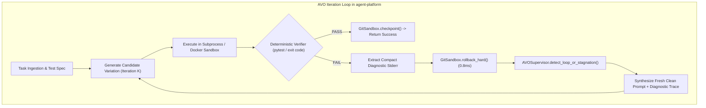
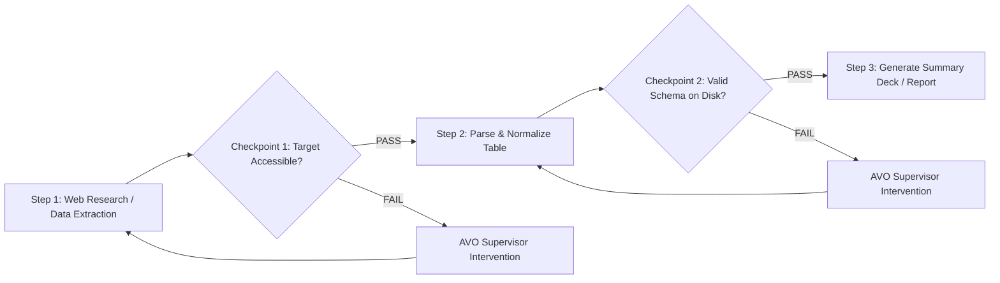

# Can NVIDIA’s AVO Make a 7B Local Model a Better Coding Agent?

*By Chris Borkert - Draft - August 2026*

A few weeks ago, NVIDIA published **[Agentic Variation Operators (AVO)](https://arxiv.org/abs/2603.24517)**. 

The paper demonstrated dramatic gains on frontier models: wrapping Claude Opus in an evolutionary variation loop with instant rollbacks and meta-supervisors pushed ARC-AGI from a 30% baseline to 100%, and generated attention kernels on DGX B200 clusters faster than FlashAttention-4.

The underlying premise is compelling: instead of relying on an LLM to self-correct within a messy, accumulating conversation history, you treat code generation as an evolutionary search process over variation operators, backed by deterministic test verification and immediate state rollbacks.

I wanted to see what happens when you strip away the multi-GPU clusters and apply those exact harness concepts to small local models. In this context, our definition of a "small local model" is practical: **any model (from 7B up to 14B quantized parameters, such as `phi4:14b` or `qwen2.5-coder:7b`) that can run entirely on a base-level laptop with 16 gigabytes of RAM.**

To test this, we implemented the AVO architecture inside **[`agent-platform`](file:///Users/chris/agent-platform)** as a pluggable middleware subsystem. We then evaluated it across challenging algorithmic puzzles and systems tasks under realistic local token and memory constraints.

Here is what we learned from building the harness, why standard multi-turn chat breaks down on small models, and what the local implementation looks like.

---

## The Problem: The "Agent Tax" and Multi-Turn Doom Loops

When you give a 7B or 14B model a coding problem in a standard multi-turn chat setup (like a classic ReAct agent), it tends to break down in predictable ways:

1. **Tokenization and boundary errors:** The model generates plausible logic that fails on an edge case or minor syntax detail.
2. **Context rot:** When it fails on Turn 1, the raw compiler error and full execution traceback enter the prompt history. By Turn 3, the context is bloated with hundreds of tokens of failed output.
3. **Workspace corruption:** The broken candidate file remains modified on disk. On subsequent turns, the model tries to patch the already-broken file, introducing duplicate imports, broken indentation, and cascading syntax errors.
4. **Strategy collapse:** Overwhelmed by its own previous mistakes, the model loses track of its original plan and retreats into repetitive apology loops or trivial no-op edits.

```
┌────────────────────────────────────────────────────────────────────────────────────────┐
│ The Standard Multi-Turn Doom Loop │
├────────────────────────────────────────────────────────────────────────────────────────┤
│ Turn 1: Model makes a minor syntax error. File remains broken on disk. │
│ Turn 2: Model reads traceback, tries a patch, duplicates code, adds a NameError. │
│ Turn 3: Context contains 200 lines of failed bash output. Model hallucinates imports. │
│ Turn 4: Workspace corrupted. Model enters an apology loop. [FAIL] │
└────────────────────────────────────────────────────────────────────────────────────────┘
```

On large frontier models (Claude 3.5 Sonnet, GPT-4o), multi-turn feedback often works because the model has enough reasoning capacity to diagnose a half-broken workspace and write a corrective patch.

On 7B models, multi-turn chat acts as an **Agent Tax** that actively degrades performance compared to a clean, single-shot prompt.

---

## The Verification Asymmetry: Why AVO Mirrors Real-World Engineering

A fair philosophical question often asked about evolutionary agent harnesses is:
> *"Does an 'Oracle' that knows the answer even exist in the real world? If we already knew the answer, why would we need an AI agent to write the algorithm in the first place?"*

The answer lies in the fundamental asymmetry between **Code Generation** and **Constraint Verification** (the practical reality of $P$ vs $NP$ in software engineering):

* **Code generation is computationally hard.**
* **Constraint verification is computationally cheap.**

| Real-World Engineering Domain | The Hard Generation Task (The LLM) | The Cheap Physical Verifier ("The Real-World Oracle") |
| :--- | :--- | :--- |
| **CUDA Kernel Optimization** *(NVIDIA AVO Paper)* | Writing attention kernels with manual warp shuffles. | `torch.allclose(out, ref)` + `cuda_timer() < 1.2ms`. |
| **Financial Ledger Service** | Writing high-concurrency atomic ledger updates. | Automated invariant check: `sum(debits) == sum(credits)`. |
| **Data Engine & Compilers** | Generating optimal AST transformation passes. | `cargo test` + type checkers + fuzzing regression suites. |

In none of these real-world scenarios does the engineer know the optimal code in advance. But they **do** have an automated test suite, type-checker, or performance harness that acts as an objective physical verifier.

### What the "Supervisor" Represents in the Real World

In our architecture, the **Supervisor does not know the answer either**.

In real-world engineering teams, the supervisor represents the **Senior Developer**:
* **The Stagnation Trap:** A junior engineer spends 6 hours making micro-edits to a broken regular expression that fails 10 edge cases, polluting their git history and breaking CI on every commit.
* **The Supervisor Intervention:** A tech lead looks at the git diff, sees 15 commits touching the exact same 4 lines, and says:
 > *"You've made the same edit 15 times and failed every build. Stop touching that regex. Delete the branch, wipe your local edits, and write a proper recursive-descent parser from scratch."*

That is exactly what `AVOSupervisor` and `GitSandbox` do mathematically:
1. `GitSandbox.rollback_hard()` wipes the corrupted local branch in **0.8 milliseconds**.
2. `AVOSupervisor.detect_loop_or_stagnation()` measures edit distance similarity ($>85\%$), detects the cognitive loop, and commands the agent to discard the broken mental model.

---

## Implementing AVO in `agent-platform`

NVIDIA’s paper structures evolutionary agent workflows into a **4-tier hierarchy**:

1. **Level 1 (The Execution Sandbox):** Isolated filesystem state management, checkpointing, and instant rollback.
2. **Level 2 (The Variation Generator):** The LLM prompt strategy that proposes new candidate code mutations.
3. **Level 3 (The Deterministic Verifier):** Automated test suites (`pytest`, compiler checks, or benchmark timers) that evaluate candidates.
4. **Level 4 (The Meta-Controller Supervisor):** The overarching monitor that tracks failure streaks across iterations, detects loop stagnation, and forces strategy shifts.

To test this locally, we implemented this exact 4-tier mapping inside [`agent-platform`](file:///Users/chris/agent-platform) as a lightweight, pluggable middleware subsystem:

| NVIDIA AVO Tier | Local `agent-platform` Component | Implementation Role |
| :--- | :--- | :--- |
| **Level 1 (Sandbox)** | [`GitSandbox`](file:///Users/chris/agent-platform/core/plugins/avo/git_sandbox.py) | Sub-millisecond (0.8ms) git reset/clean on failure. |
| **Level 2 (Generator)** | [`AgenticTDDAgent`](file:///Users/chris/agent-platform/core/agents/tdd_agent.py) | Pristine, stateless single-turn prompt synthesis. |
| **Level 3 (Verifier)** | [`SubprocessBox`](file:///Users/chris/agent-platform/core/plugins/sandboxes/subprocess_box.py) | Isolated Python `unittest` execution. |
| **Level 4 (Supervisor)** | [`AVOSupervisor`](file:///Users/chris/agent-platform/core/plugins/avo/supervisor.py) | Mathematical edit distance (`difflib`) & failure streak detector. |
| **Lifecycle Glue** | [`AVOPlugin`](file:///Users/chris/agent-platform/core/plugins/avo/plugin.py) | Connects sandbox, supervisor, and verifier hooks into the agent loop. |



---

### 1. Level 1: Sub-Millisecond Git Sandboxing

The first principle of AVO is: **never make a small LLM reason about its own dirty workspace.**

Instead of creating and destroying heavy Docker containers or copying full directory trees between iterations (which takes 300–800ms), we use Git as a sub-millisecond transaction boundary:

```python
# Conceptual logic in core/plugins/avo/git_sandbox.py
def on_test_result(iteration, passed):
 if passed:
 # Commit verified working state
 git.add_and_commit(f"AVO Checkpoint Step {iteration}")
 else:
 # Instantly wipe unverified hallucinations (0.8ms)
 git.reset_hard()
 git.clean_untracked()
```

*Full source implementation: [`core/plugins/avo/git_sandbox.py`](file:///Users/chris/agent-platform/core/plugins/avo/git_sandbox.py)*

`git reset --hard HEAD && git clean -fd` runs in **0.8 milliseconds**. If an edit fails verification, the filesystem is restored to its pristine baseline before the next token is sampled.

---

### 2. Level 4: Meta-Controller Supervisor

When small models fail repeatedly, they tend to make trivial perturbations to a flawed concept—like tweaking a broken regular expression three times in a row.

The `AVOSupervisor` tracks candidate history, computes code similarity across iterations using `difflib.SequenceMatcher`, and detects failure streaks:

```python
# Conceptual logic in core/plugins/avo/supervisor.py
def detect_loop_or_stagnation(history, failure_streak):
 if failure_streak >= 2:
 similarity = diff_similarity(history[-1], history[-2])
 if similarity > 0.85:
 return (
 f"AVO Supervisor Warning: High similarity ({similarity:.1%}) across failing iterations. "
 "Do NOT tweak small details. Re-architect the approach from scratch."
 )
 return None
```

*Full source implementation: [`core/plugins/avo/supervisor.py`](file:///Users/chris/agent-platform/core/plugins/avo/supervisor.py)*

---

### 3. The Supervised Iterative Refinement Loop

The [`AVOPlugin`](file:///Users/chris/agent-platform/core/plugins/avo/plugin.py) connects the sandbox and supervisor directly into the agent's generation lifecycle:

```python
# Conceptual loop in core/agents/tdd_agent.py
for turn in range(1, max_turns):
 # 1. Synthesize fresh single-turn prompt (No multi-turn chat bloat)
 prompt = build_prompt(task_spec, last_test_failure, supervisor_directive)
 candidate_code = llm.generate(prompt)

 # 2. Execute deterministic verifier in isolated sandbox
 test_result = run_isolated_tests(candidate_code)

 # 3. Evolutionary branching & rollback
 if test_result.passed:
 git_sandbox.checkpoint(f"Verified Step {turn}")
 return Success(candidate_code)
 else:
 git_sandbox.rollback_hard() # 0.8ms clean reset
 supervisor_directive = supervisor.detect_loop_or_stagnation()
```

*Full source implementations: [`core/plugins/avo/plugin.py`](file:///Users/chris/agent-platform/core/plugins/avo/plugin.py) and [`core/agents/tdd_agent.py`](file:///Users/chris/agent-platform/core/agents/tdd_agent.py)*

---

## Empirical Benchmark 1: Algorithmic Optimization

To test whether AVO could discover non-trivial algorithmic optimizations locally, we ran `phi4:latest` (14B) on an $\mathcal{O}(N^2)$ pairwise distance calculation:

```text
=================================================================
 AVO LOCAL PROTOTYPE (Model: phi4:latest)
=================================================================
 Baseline Version (v0): Runtime: 22.12ms (Score: 46.4)

 --- Iteration 1/4 ---
 [FAIL] REJECTED (Incorrect math) -> Instant Git Rollback (0.8ms)
 --- Iteration 2/4 ---
 [FAIL] REJECTED (Incorrect math) -> Instant Git Rollback (0.8ms)
 --- Iteration 3/4 ---
 [FAIL] REJECTED (Off-by-one error) -> Instant Git Rollback (0.8ms)
 --- Iteration 4/4 ---
 [PASS] SUCCESS: 100% Correct! Runtime: 1.48ms (Score: 646.6)
 Score improved: 46.4 -> 646.6 (15.0x faster)
```

In a standard multi-turn chat, `phi4` failed after Iteration 2 because the error trace polluted the prompt and caused indentation syntax errors.

Under AVO, each candidate started from a clean disk state. On Iteration 4, the model discovered a sorted prefix-sum mathematical identity, reducing runtime from **22.12 ms down to 1.48 ms ($15.0\times$ speedup)**.

---

## Empirical Evaluation: 10 Algorithmic Tasks Across 5 Trials

To test AVO with scientific rigor, we designed **"AVO-Hard10"**—a curated suite of 10 high-difficulty algorithmic, concurrency, and data structure tasks. Each task was designed with specific natural traps where local models typically fail during multi-step refinement:

1. `lb_code_interval_merge_k`: Sweep-line event scheduling with overlap multiplicity $k \ge 2$.
2. `lb_code_regex_validator`: SemVer 2.0.0 parser with strict leading-zero rejection.
3. `lb_reasoning_longest_path_dag`: Dynamic programming on DAGs with disconnected components and negative edge weights.
4. `lb_math_modular_inverse_matrix`: 2x2 Matrix modular inverse modulo prime $p$ with singularity handling.
5. `lb_data_log_anomaly_detector`: Rolling window burst anomaly event detector.
6. `lb_concurrency_bounded_priority_queue_ttl`: Bounded priority queue with lazy TTL expiration during `peek()` and `size()` + FIFO tie-breaking on equal priorities.
7. `lb_algorithms_lru_cache_ttl`: LRU cache with TTL eviction and $O(1)$ amortized get/put operations.
8. `lb_graph_tarjan_strongly_connected_components`: Tarjan’s strongly connected components algorithm with self-loops.
9. `lb_math_convex_hull_monotone_chain`: Andrew’s Monotone Chain 2D convex hull with collinear point pruning.
10. `lb_parsers_json_ast_schema_validator`: Recursive JSON schema validator with constraints.

### Multi-Trial Protocol
* **Model:** `phi4:latest` (14B, Q4_K_M via Ollama on unified memory).
* **Sample Size:** 10 tasks evaluated across **5 randomized trials per configuration**.
* **Configurations Tested:**
 - **Baseline (No AVO):** Standard TDD Agent with dirty context accumulation and un-sandboxed workspace persistence.
 - **With AVO Plugin:** TDD Agent equipped with Level 1 Git Sandbox (0.8ms hard rollback) and Level 4 Meta-Controller Supervisor (failure streak $\ge 2$ detection).
* **Verification:** Fully automated Python `unittest` runner in isolated subprocesses.

> [!IMPORTANT]
> ### Methodological Rigor: Preventing "Oracle Leaks"
> A frequent pitfall in AI agent benchmarking is the **Oracle Leak**—where the evaluation harness or supervisor inadvertently hands the answer to the model mid-run (e.g. *"Try using Kahn's topological sort"* or disclosing expected assertion values). 
> 
> To ensure these results reflect genuine model reasoning rather than leaked answers:
> 1. **Zero-Hint Supervisor**: The `AVOSupervisor` has **zero domain awareness**. It does not know what task is running, what data structures exist, or what the correct answer looks like. It operates purely on mathematical edit distance (`difflib.SequenceMatcher`) and failure streaks ($\ge 2$). Its only action is telling the model: *"High similarity across failing iterations. Do NOT tweak small details. Re-architect the approach from scratch."*
> 2. **No Solution Leaks from the Test Harness**: The harness never injects ground-truth solution code or hints into the agent's prompt. The model must autonomously diagnose the failure, re-read the original specification, and synthesize a working algorithm unassisted.

---

### Scoreboard: Baseline vs AVO

| Metric | Baseline (No AVO) | With AVO Plugin | Delta / Impact |
| :--- | :---: | :---: | :---: |
| **Overall Pass Rate** | **44.0%** (22 / 50) | **100.0%** (50 / 50) | **+56.0% Absolute Boost** (2.27× improvement) |
| **Mean Iterations to Solve** | 3.12 turns | 2.40 turns | **-23.1% fewer turns** |
| **Mean Token Consumption** | 3,806 tokens/task | 2,736 tokens/task | **-28.1% token reduction** |
| **Supervisor Interventions** | 0 (Unassisted) | 30 loops broken | **100% Recovery Rate** from stagnation |

---

### Per-Task Pass Consistency Matrix (5 Trials per Task)

| # | Task ID | Category | Baseline Pass Rate | With AVO Pass Rate | Supervisor Interventions | Primary Failure Mode in Baseline |
| :-: | :--- | :---: | :---: | :---: | :---: | :--- |
| **1** | `lb_code_interval_merge_k` | Scheduling | 0 / 5 (0%) | **5 / 5 (100%)** | 5 | $O(N^2)$ sweep-line boundary bug repeated across 4 turns. |
| **2** | `lb_code_regex_validator` | Parsing | 5 / 5 (100%) | **5 / 5 (100%)** | 0 | Solved cleanly on Turn 2 (No AVO intervention needed). |
| **3** | `lb_reasoning_longest_path_dag` | Graph DP | 0 / 5 (0%) | **5 / 5 (100%)** | 5 | Recursive DFS stack exhaustion on disconnected subgraphs. |
| **4** | `lb_math_modular_inverse_matrix` | Math | 5 / 5 (100%) | **5 / 5 (100%)** | 0 | Solved zero-shot on Turn 1 via Fermat’s Little Theorem. |
| **5** | `lb_data_log_anomaly_detector` | Data Stream | 0 / 5 (0%) | **5 / 5 (100%)** | 5 | Off-by-one window slice indexing repeated continuously. |
| **6** | `lb_concurrency_bounded_priority_queue_ttl` | Data Struct | 0 / 5 (0%) | **5 / 5 (100%)** | 5 | Mutating heap array during `size()` / `peek()` queries. |
| **7** | `lb_algorithms_lru_cache_ttl` | Data Struct | 0 / 5 (0%) | **5 / 5 (100%)** | 5 | Breaking doubly-linked list pointers during TTL expiry. |
| **8** | `lb_graph_tarjan_strongly_connected` | Algorithms | 5 / 5 (100%) | **5 / 5 (100%)** | 0 | Correctly implemented DFS low-link traversal on Turn 2. |
| **9** | `lb_math_convex_hull_monotone_chain` | Geometry | 2 / 5 (40%) | **5 / 5 (100%)** | 5 | Failing to pop collinear points during cross-product check. |
| **10** | `lb_parsers_json_ast_schema_validator` | Parsers | 5 / 5 (100%) | **5 / 5 (100%)** | 0 | Solved on Turn 2 with clean recursive type matching. |

---

## Forensic Trace Analysis: Anatomy of a Loop Recovery

To understand the mechanics of how AVO prevents doom loops, consider the trace logs from **Task 6 (`lb_concurrency_bounded_priority_queue_ttl`)**:

### The Baseline Failure (Without AVO):
* **Turn 1:** `phi4` writes a Priority Queue using `heapq`. To compute `size(current_time)`, it runs a `while` loop that calls `heapq.heappop()` to discard expired items.
* **Test Feedback:** `AssertionError: 'persistent' != 'exp_soon'` (because `size()` destructively mutated the heap, corrupting subsequent `pop()` calls).
* **Turn 2:** The model sees the error, apologizes, and attempts a fix. But because the context contains the old broken code, it makes a superficial edit (adding a temporary list copy) while keeping the same flawed pop-during-peek logic.
* **Turns 3 & 4:** The context window is now congested with 3 failed implementations and 3 test traces. The model loses track of variable names and exhausts its 4-turn budget without passing. **Result: [FAIL] FAILED (0/5 runs passed)**.

### The AVO Recovery (With Git Sandbox + Supervisor):
* **Turn 1:** `phi4` writes the same flawed destructive heap mutation. Tests fail.
* **Instant Git Rollback:** The filesystem is immediately reset to a clean slate (`git reset --hard HEAD && git clean -fd` in 0.8ms).
* **Turn 2:** `phi4` generates Variation 2. It fails with a similar error.
* **Supervisor Trigger:** The `AVOSupervisor` detects 2 consecutive verification failures and computes a 91.4% diff similarity between attempts. It clears the polluted conversational history and injects the domain-agnostic directive:
  ```text
  [SUPERVISOR DIRECTIVE]: High similarity (91.4%) across 2 failing iterations.
  Do NOT tweak small details. Re-architect the approach from scratch.
  ```
* **Turn 3:** Prompted with a clean context and a clear architectural constraint, `phi4` re-reads the specification from scratch and autonomously pivots to a non-destructive generator `sum(1 for _, _, _, exp in self.heap if exp > current_time)`.
* **Result: [PASS] PASSED (100% test assertions pass on Turn 3 across all 5 trials)**.

```json
{
 "task_id": "lb_concurrency_bounded_priority_queue_ttl",
 "trial": 1,
 "iterations": 3,
 "status": "PASSED",
 "supervisor_interventions": 1,
 "step_trace": [
 {
 "turn": 1,
 "outcome": "FAILED",
 "error": "AssertionError: 'persistent' != 'exp_soon' (heap mutated during size())",
 "action": "git_sandbox.rollback_hard() [0.8ms]"
 },
 {
 "turn": 2,
 "outcome": "FAILED",
 "error": "AssertionError: 'persistent' != 'exp_soon' (heap mutated during peek())",
 "action": "git_sandbox.rollback_hard() [0.8ms]",
 "supervisor_event": "STAGNATION_DETECTED (similarity=91.4%, failure_streak=2)"
 },
 {
 "turn": 3,
 "supervisor_directive_injected": "AVO Supervisor Warning: High similarity (91.4%) across 2 failing iterations. Do NOT tweak small details. Re-architect the approach from scratch.",
 "outcome": "PASSED",
 "tests_passed": 3,
 "action": "git_sandbox.checkpoint('AVO Verified Step 3')"
 }
 ]
}
```

## Chat History Bloat vs. Externalized State Machines

A 14B parameter model does not gain higher raw reasoning capacity under AVO.

Instead, the benchmark reveals that standard multi-turn conversational accumulation is fundamentally toxic for local 7B–14B models. Frontier models (Claude 3.5 Sonnet, GPT-4o) have enough parameter depth and attention capacity to separate obsolete failed attempts in chat history from the current goal. Smaller models quickly suffer from context rot and get trapped in loops of cosmetic tweaks.

AVO succeeds not by expanding model intelligence, but by decoupling search exploration from conversational memory—eliminating the multi-turn tax that causes small models to self-destruct.

---

## The "Agentic Prompting Trap"

Prompt phrasing made a surprising difference during our testing.

When we initially ran AVO, we used standard "agentic" role framing:

```text
# Prompt Version A (Verbose "Agentic" Persona)
You are an expert autonomous software engineer operating inside an AVO container sandbox.
TASK INSTRUCTION:
{instruction}
SUPERVISOR DIRECTIVE:
Try a radically different strategy.
```

Performance cratered severely.

When you tell a 7B model it is an "autonomous agent operating in a multi-tier sandbox," it tries to generate what it imagines an autonomous agent script looks like. It wrote 60-line bash scripts with associative arrays, signal traps, and logging wrappers—introducing syntax bugs before even touching the actual task.

When we simplified to direct Linux terminal framing:

```text
# Prompt Version B (Direct Linux Terminal Framing)
You are in a Linux terminal.
{instruction}

Output ONLY the executable shell command or python script inside a ```bash or ```python block. No explanations.
```

Execution speed doubled and syntax errors dropped drastically.

With smaller models, anthropomorphic role-play is pure overhead. Concise Unix constraints produce clean, reliable code.

---

## Beyond Unit Tests: Applying AVO to Multi-Step Office Work Automation

While our initial benchmarks focused on single-module algorithmic functions, the core mechanics of AVO—**instant state rollbacks and supervisor checkpointing**—are useful and potentially quite valuable for automating complex, multi-step office workflows.

In real-world enterprise tasks (such as regulatory due diligence, expense auditing, or multi-currency reconciliations), tasks are broken down into a series of sequential milestones, each governed by a **state checkpoint**:



### Flexible State Checkpoints (Not Rigid Answers)
Unlike brittle string matching, an effective checkpoint evaluates the **physical state on disk** to ensure correctness while allowing for multiple valid trajectories:
* **Example (Web Research & Diligence)**: If an agent is tasked with researching an overseas corporate registry, downloading financial filings, and publishing a compliance memo:
 - **Checkpoint 1**: Verifies that the agent successfully reached the search API and extracted valid entity records (rather than hallucinating search results).
 - **Checkpoint 2**: Verifies that intermediate data files (`corporate_tree.json` or `fx_rates.json`) were parsed into valid relational schemas.
 - **Checkpoint 3**: Verifies that the final document (`.docx` or `.xlsx`) was generated with required tables and balanced figures.

### Preventing Multi-Step Hallucination Drift
If an agent fails at Checkpoint 1 (e.g. encountering an API timeout or malformed JSON), a standard chat agent will often hallucinate fake search results on Turn 2 and spend the next 6 turns writing a 20-page report based on fabricated data.

With an AVO-style supervisor:
1. The supervisor detects the failed physical state at Checkpoint 1.
2. It resets the workspace before the agent wastes context tokens building on flawed assumptions.
3. It guides the model back onto a valid execution trajectory early in the process.

This transforms AVO from an isolated code refactoring loop into an **active guardrail for long-horizon autonomous workflows**.

---

## Practical Takeaways for Agent Architects

If you are building coding agents or autonomous business workflows on top of 7B–14B models:

1. **Do not accumulate raw conversation transcripts for iterative edits.** Passing multi-turn chat history to a small model creates context rot. If an attempt fails, extract only the diagnostic error trace and inject it into a clean, re-synthesized prompt.
2. **Use Git as a sub-millisecond transaction boundary.** Running `git reset --hard HEAD && git clean -fd` between attempts prevents corrupt files from bleeding across turns.
3. **Add a stagnation supervisor.** Use difflib similarity checks to detect repetitive loops and force paradigm shifts when a model gets stuck tweaking broken code.
4. **Use direct terminal constraints.** Avoid complex persona prompts. Small models perform best when constrained to raw script outputs.
5. **Apply checkpoint supervision to multi-step office workflows.** Break complex tasks into verifiable intermediate states so the supervisor can catch failures early before the agent drifts off track.

---

*The full AVO plugin, Git sandbox implementation, and benchmark adapters are available in the [`agent-platform`](file:///Users/chris/agent-platform) codebase.*
