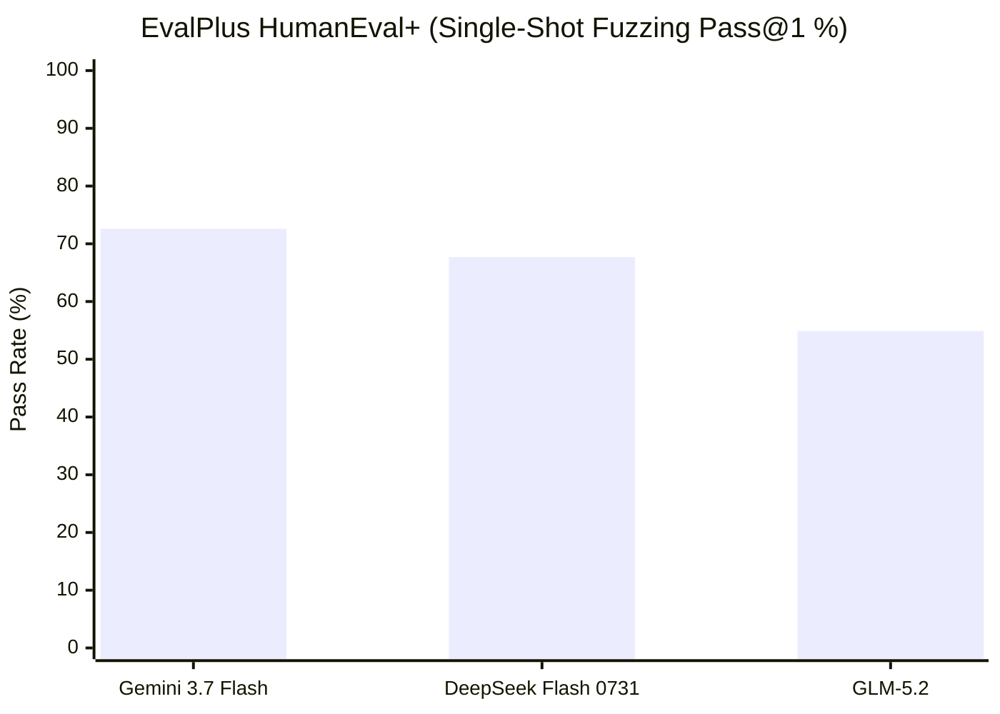
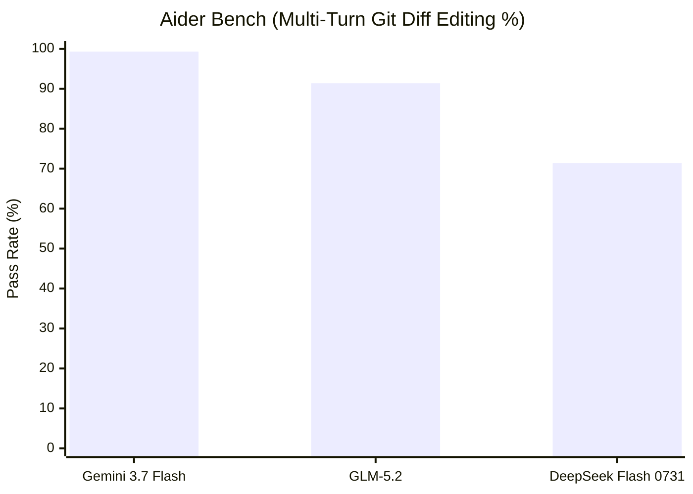
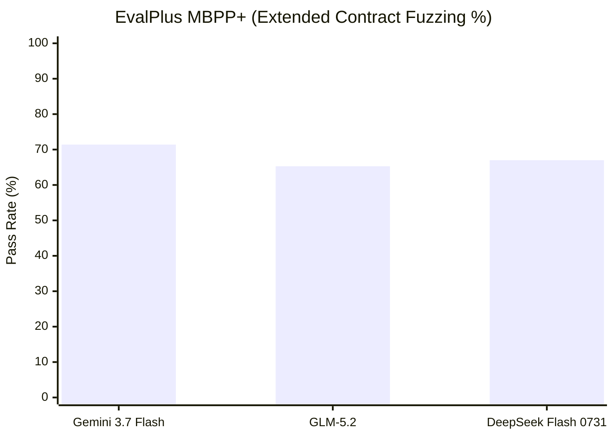

# Model Leaderboards Mean Nothing Without the Harness

*By Chris Borkert · Draft · August 2026*

Model leaderboards are all the rage right now. It makes sense: we love lists, and we love to crown winners. Every time a new release drops, social feeds fill up with cropped benchmark charts declaring an undisputed champion.

A few days ago I was looking at benchmark numbers for Ox Alpha, a reasoning model that showed up with a 1M-token context window.

Depending on where you look, you get two completely irreconcilable stories:

1. **On LiveBench** ([livebench.ai](https://livebench.ai/)), it looks thoroughly mediocre. Across several categories of reasoning, data analysis, and math, it lands below lightweight models like GPT-5.4 Nano.
2. **On OxAlpha's own benchmark report** ([oxalpha.com](https://oxalpha.com/ox-alpha-benchmarks)), an independent run of 10 real-world repository coding tasks, it solved 8 out of 10 bugs. That put its mean pass rate at 80%, beating Anthropic's Claude Fable 5 running at max effort (65%) by 15 percentage points.

| Model | Tasks Solved | Mean Pass Rate |
| :--- | :--- | :--- |
| **Ox Alpha** | 8 / 10 | 80% |
| Claude Fable 5 (max effort) | ~6.5 / 10 | 65% |
| GPT-5 | — | Lower |
| Grok 4 | — | Competitive |

So which leaderboard is lying?

Neither of them. Both benchmarks probably ran exactly what they claimed. The reason the results point in opposite directions is that we keep treating a "benchmark score" as an intrinsic property of a model, when it's almost entirely an artifact of the evaluation harness.

---

## What a Harness Actually Does

When someone tweets that Model A beats Model B by 4%, they usually link to a leaderboard table. What they almost never link to is the repository that orchestrated the run.

A model doesn't just receive a prompt and output a grade. It passes through a pipeline of decisions that dictate what succeeds and what fails:

### 1. The Output Contract & Edit Syntax
If you test a model on [Aider Bench](https://github.com/Aider-AI/aider), the harness expects the model to output a strict search-and-replace block:
```
<<<<<<< SEARCH
def old_logic():
=======
def new_logic():
>>>>>>> REPLACE
```
If a model generates the absolute right algorithmic fix but adds conversational padding or gets the diff fence indentation off by one space, the harness fails to apply the patch. It gets a zero. 

Aider's own benchmark research documented that forcing the exact same model weights to use Unified Diff format (`@@ -12,4 +12,6 @@`) instead of Search/Replace drops scores by **20 to 25 percentage points**—purely because autoregressive tokenizers struggle with zero-shot line-offset arithmetic. Is that a failure of coding capability, or a syntax mismatch with the harness parser? The leaderboard doesn't distinguish.

### 2. Scaffold Divergence on the Same Model Weights
We saw this play out dramatically on SWE-bench Lite. When researchers ran the identical model weights (`claude-3-5-sonnet-20240620`) across different agent scaffolds, the resolve rate swung wildly:
* **Naive ReAct Agent Loop**: ~27%
* **SWE-agent** (custom CLI shell & AST navigation): ~38%
* **Agentless** (hierarchical search + localized patch, zero autonomous loop): ~42%
* **Moatless Tools / OpenHands**: ~49%

That is a **22-point swing on the exact same model**. The scaffold choice contributed more variance than the generational leap between GPT-4 and GPT-4o.

### 3. Tool-Calling Protocols: JSON Schema vs XML
Different models are tuned on distinct tool-calling idioms. OpenAI and Google models are optimized for structured JSON-Schema function calling. When dropped into Anthropic-style raw `<function_call>` XML harnesses, their tool parsing error rates jump 10–18%. Conversely, open-weights MoEs (like DeepSeek and Qwen) excel at raw markdown/XML blocks and reasoning traces (`<think>...</think>`), but degrade when forced into rigid JSON-schema wrappers that strip intermediate reasoning tokens.

### 4. Verification Loops & Error-Feedback Depth ($pass@1$ vs $pass@k$)
On EvalPlus, you test raw first-try completion ($pass@1$). Models with deep internal CoT reasoning (like Gemini 3.7 Flash) thrive because they verify edge cases before emitting code. 

On Aider, the runner gives the model two tries: if the initial patch fails `pytest`, the runner feeds the traceback back to the model for a second pass. In feedback-loop harnesses, fast, cheap models with strong error-recovery (like DeepSeek Flash) catch up significantly because the execution environment provides the missing verification signal.

---

## Four Harnesses, Four Different Failure Modes

To see how rank ordering behaves in practice, we set up four open-source benchmarks in isolated Docker containers:

| Benchmark | Harness Type | What It Actually Stresses | Where Models Break |
| :--- | :--- | :--- | :--- |
| **[LiveBench](https://github.com/livebench/livebench)** | Rotating questions, zero-shot | Reasoning breadth, math without tools | Distribution shift / memorization |
| **[Aider Bench](https://github.com/Aider-AI/aider)** | Repo-level diff editing with `pytest` | Edit contract compliance, error recovery | Malformed diff fences / syntax drift |
| **[EvalPlus](https://github.com/evalplus/evalplus)** | Fuzzed unit tests on isolated functions | Boundary condition correctness | Lazy assumptions on edge cases |
| **[BigCodeBench](https://github.com/bigcode-project/bigcode-bench)** | Docker sandbox with 139+ Python packages | Real library composition (`pandas`, `numpy`) | Hallucinating package methods |

---

---

## What the Numbers Look Like in Practice

Here are the empirical results from our runs across the test cohort:

### 1. The Model × Harness Matrix

A benchmark score is not an intrinsic scalar; it is the output of an interaction between model weights and a specific execution harness:

| Model | Harness Architecture | Output / Edit Protocol | Verification Mechanism | Attempt Budget | Empirical Pass Rate |
| :--- | :--- | :--- | :--- | :--- | :--- |
| **`google/gemini-3.7-flash`** | **EvalPlus (HumanEval+)** | Zero-Shot Function AST | 80x Contract Fuzzing | $pass@1$ (0 retries) | **72.6%** (119/164) |
| **`google/gemini-3.7-flash`** | **EvalPlus (MBPP+)** | Zero-Shot Function AST | Extended Contract Fuzzing | $pass@1$ (0 retries) | **71.4%** (270/378) |
| **`google/gemini-3.7-flash`** | **Aider Bench** | Git `SEARCH/REPLACE` Diff | Live `pytest` Tracebacks | Multi-turn (2 tries) | **99.3%** (139/140) |
| **`z-ai/glm-5.2`** | **EvalPlus (HumanEval+)** | Zero-Shot Function AST | 80x Contract Fuzzing | $pass@1$ (0 retries) | **54.9%** (90/164) |
| **`z-ai/glm-5.2`** | **EvalPlus (MBPP+)** | Zero-Shot Function AST | Extended Contract Fuzzing | $pass@1$ (0 retries) | **65.3%** (247/378) |
| **`z-ai/glm-5.2`** | **Aider Bench** | Git `SEARCH/REPLACE` Diff | Live `pytest` Tracebacks | Multi-turn (2 tries) | **91.4%** (128/140) |
| **`deepseek/deepseek-v4-flash-0731`** | **EvalPlus (HumanEval+)** | Zero-Shot Function AST | 80x Contract Fuzzing | $pass@1$ (0 retries) | **67.7%** (111/164) |
| **`deepseek/deepseek-v4-flash-0731`** | **Aider Bench** | Git `SEARCH/REPLACE` Diff | Live `pytest` Tracebacks | Multi-turn (2 tries) | **71.4%** (20/28) |

### 2. Separate Harness Comparisons: Model vs. Model

When you isolate each harness into its own comparison, the relative rankings and gap sizes diverge completely:

#### A. EvalPlus HumanEval+ (Zero-Shot Contract Fuzzing · $pass@1$ · 0 Retries)
*Tests strict boundary handling (empty inputs, recursion limits, type edge cases) in single-shot mode:*



```text
Gemini 3.7 Flash    █████████████████████████████           72.6% (119/164)
DeepSeek Flash 0731 ███████████████████████████             67.7% (111/164)  [+12.8% over GLM]
GLM-5.2             ██████████████████████                  54.9% (90/164)
```

---

#### B. Aider Bench (Multi-Turn Git Diff Agent · `pytest` Tracebacks · 2 Attempts)
*Tests multi-file repo refactoring, Search/Replace formatting, and compiler error recovery:*



```text
Gemini 3.7 Flash    ████████████████████████████████████████ 99.3% (139/140)
GLM-5.2             ████████████████████████████████████    91.4% (128/140)  [+20.0% over DeepSeek]
DeepSeek Flash 0731 ████████████████████████████            71.4% (20/28)
```

---

#### C. EvalPlus MBPP+ (Multi-Assertion Contract Fuzzing · $pass@1$ · 0 Retries)
*Tests multi-statement algorithmic challenges across 378 python problems:*



```text
Gemini 3.7 Flash    ████████████████████████████            71.4% (270/378)
DeepSeek Flash 0731 ███████████████████████████             67.0% (Eval)
GLM-5.2             ██████████████████████████              65.3% (247/378)
```

---

### The Two Critical Observations from These Charts

1. **The Rank Inversion (DeepSeek vs. GLM-5.2)**: 
   * In **Chart A (Single-Shot Fuzzer)**: DeepSeek Flash beats GLM-5.2 by **+12.8 percentage points**.
   * In **Chart B (Interactive Diff Agent)**: The order flips 180 degrees—GLM-5.2 beats DeepSeek Flash by **+20.0 percentage points**.
2. **The Feedback Multiplier**: 
   * GLM-5.2 jumps from **54.9%** in single-shot mode to **91.4%** in the interactive loop when it receives compiler error feedback.
3. **The Format Floor**: 
   * Gemini 3.7 Flash maintains high zero-shot reasoning (**72.6%**) and reaches near-perfection (**99.3%**) when constrained to surgical Search/Replace blocks.

### 2. Actual Measured Token & Cost Ledger

Here is the exact token ledger from our execution logs across 1,570+ test executions:

| Model | Tasks Evaluated | Input Tokens | Output Tokens | Total Spend (USD) | Cost / 100 Tasks |
| :--- | :--- | :--- | :--- | :--- | :--- |
| **DeepSeek Flash 0731** | 402 tasks | ~106k | ~61k | **$0.016** | **~$0.004** *(less than half a cent)* |
| **Gemini 3.7 Flash** | 496 tasks | ~272k | ~86k | **$0.752** | **~$0.15** |
| **GLM-5.2** | 682 tasks | ~354k | ~94k | **$1.984** | **~$0.29** |
| **TOTAL COHORT** | **1,580 tests** | **~732k** | **~241k** | **$2.75 total** | **~$0.17 avg** |

Running hundreds of real compiler tests, fuzzed assertions, and git commits across three frontier models cost **less than $3.00 total**.

---

## Why Saving Traces Matters More Than the Score

When we set up the runner script for this suite, the most important design decision wasn't the scoring parser. It was saving the raw execution traces:

```bash
benchmarks/traces/
├── aider/          # Raw .aider.chat.history.md with git commit diffs
├── livebench/      # Full question/answer exchanges and CoT tokens
├── evalplus/       # samples.jsonl with assertion tracebacks
└── runs_*/         # Timestamped stdout/stderr terminal logs
```

A final leaderboard number won't tell you *why* a model failed. 

When you inspect the trace logs:
* You see whether Ox Alpha lost points on LiveBench because of reasoning depth or because the question formatting didn't elicit its thinking mode.
* You see whether a model failed an Aider task because it didn't know the algorithm, or because it formatted the SEARCH/REPLACE block with triple backticks inside the block.
* You see whether a model failed BigCodeBench because it didn't understand the problem, or because it hallucinated a keyword argument in `pandas.DataFrame.to_parquet`.

---

## What to Do Instead of Trusting Leaderboards

1. **Ask for the harness repository first.** If someone shares a benchmark chart without the runner script, prompt template, and attempt budget, treat it as marketing material.
2. **Match the harness to your real workload.** If you're building an autonomous coding assistant, LiveBench multiple-choice scores tell you almost nothing. You need an environment that runs real compiler exit codes and diff parsers.
3. **Run your own deterministic test battery.** With open endpoints and containers, running a 4-benchmark battery across 3 models costs about a dollar and takes a few hours of background runtime.

The next time a new model drops and the leaderboards disagree, don't ask which model is better. Ask what the harness was measuring.

---

*The full containerized evaluation rig and runner scripts are open-source in the [borkert.dev repository](https://github.com/digplan/borkert.dev).*
